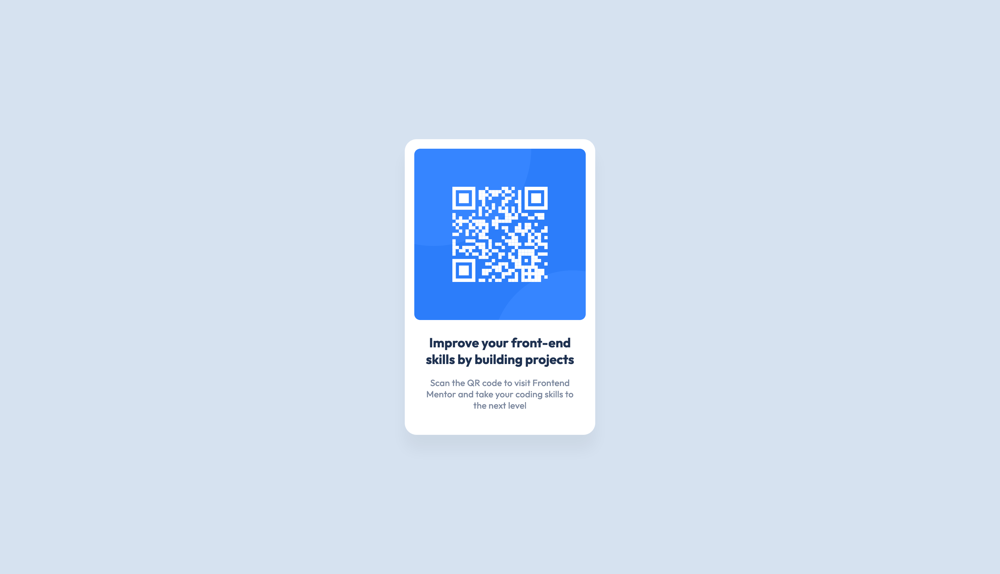
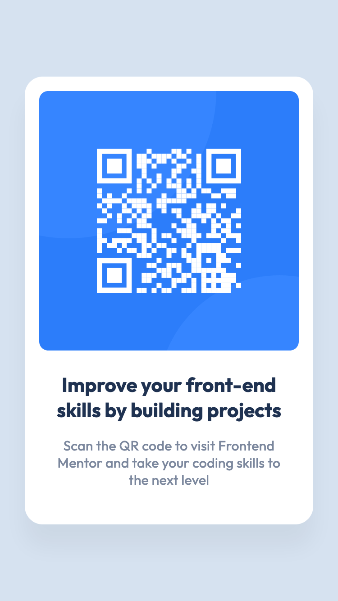

<p align="center">
  
</p>

<h1 align="center">QR code component challenge</h1>

<div align="center">
  <h3>
    <a href="https://vivian-mca.github.io/frontendmentor-challenges/QR%20code%20component/">
      Live
    </a>
    <span> | </span>
    <a href="https://www.frontendmentor.io/solutions/qr-code-component-using-cube-css-KGJLAeu1LL">
      Solution
    </a>
   <span> | </span>
    <a href="https://www.frontendmentor.io/challenges/qr-code-component-iux_sIO_H">
      Challenge
    </a>
  </h3>
</div>
<div align="center">
   Solution for a challenge from  <a href="https://www.frontendmentor.io/" target="_blank">frontendmentor.io</a>.
</div>
<br> <!-- omit in toc -->

## Table of contents <!-- omit in toc -->

- [Overview](#overview)
  - [About](#about)
  - [Screenshot](#screenshot)
- [My process](#my-process)
  - [Built with](#built-with)
  - [What I learned](#what-i-learned)
  - [Continued development](#continued-development)
  - [Useful resources](#useful-resources)
- [Author](#author)

## Overview

### About

A perfect first challenge if you're new to HTML and CSS. The card layout doesn't shift, so it's ideal if you haven't learned about building responsive layouts yet.

Users should be able to:
1. View the optimal layout depending on their device's screen size

### Screenshot

<p align="center"><em>Mobile design</em></p>
<p align="center">
  
</p>

## My process
### Built with

- Semantic HTML5 markup
- CSS CUBE methodology
- CSS custom properties
- CSS logical properties
- CSS grid
- Mobile-first workflow

### What I learned

This was a great beginner practice for basic HTML and CSS. I implemented CSS CUBE methodology and "The Stack" layout from [Every Layout](https://every-layout.dev/layouts/stack/) as shown below.

```css
.flow > * + * {
  margin-block-start: var(--space, 1.6rem);
}

.flow-exception {
  --space: 2.4rem;
}
```

I also implemented CSS logical properties for this project. Instead of using `margin-top`, I used `margin-block-start`.

### Continued development

Overall, I would like to improve on building apps from design files faster.

I would also like to incorporate Sass in my future projects.

### Useful resources

- [CSS Logical Properties and Values](https://css-tricks.com/css-logical-properties-and-values/) - This is a good resource for learning about CSS Logical Properties and Values.
- [CUBE CSS documentation](https://cube.fyi/) - From the docs: "CUBE CSS is a CSS methodology that’s orientated towards simplicity, pragmatism and consistency. It’s designed to work with the medium that you’re working in—often the browser—rather than against it."
- [Every Layout](https://every-layout.dev/) - Extremely helpful resource for simplifying CSS layouts.
- [Figma](https://figma.com/) - Really helpful for extracting information about measurements
- [Perfect Pixel](https://chrome.google.com/webstore/detail/perfectpixel-by-welldonec/dkaagdgjmgdmbnecmcefdhjekcoceebi) - Awesome Chrome extension that helps you to match the pixels of the provided design.
- [Responsively App](https://responsively.app/) - This DevTool helps in responsive web development. It allows you to see mirrored user-interactions across all devices.

## Author

- Frontend Mentor - [@vivian-mca](https://www.frontendmentor.io/profile/vivian-mca)
